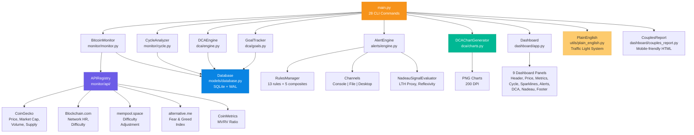
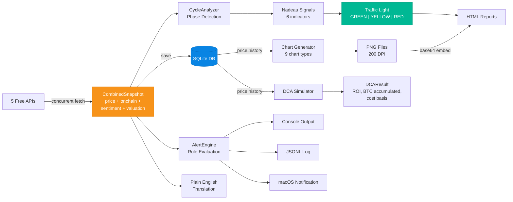
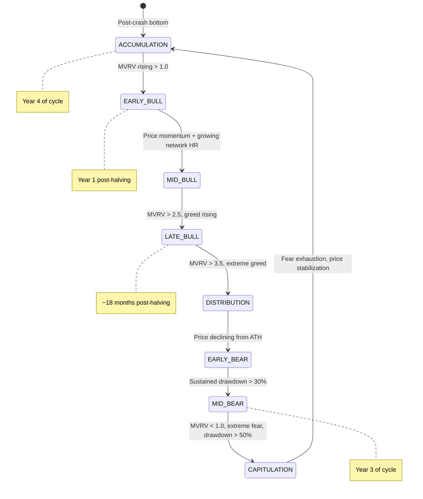

# Bitcoin Cycle Monitor

**Personal Bitcoin onchain monitoring, DCA simulation, cycle analysis & couple-friendly planning tool.**

> 128 tests | 28 CLI commands | 5 free APIs | 9 chart types | 50+ source files

Built on Michael Nadeau's (The DeFi Report) cycle analysis framework. Tracks MVRV, Fear & Greed, network HR, halving cycles, and drawdowns — all from free APIs. Includes a DCA simulator, goal tracker, alert system, terminal dashboard, and a couple-friendly plain English mode for planning together.

**Who it's for:** Anyone DCA'ing into Bitcoin who wants to understand where we are in the cycle, what the data says, and how their accumulation strategy is tracking — without paying for expensive analytics platforms.

---

## Table of Contents

- [Quick Start](#quick-start)
- [Architecture](#architecture)
- [CLI Command Reference](#cli-command-reference)
- [Module Deep-Dive](#module-deep-dive)
- [Nadeau Signal Framework](#nadeau-signal-framework)
- [Charts & Visuals](#charts--visuals)
- [Configuration Reference](#configuration-reference)
- [Data Flow Traces](#data-flow-traces)
- [Project File Tree](#project-file-tree)
- [Testing](#testing)
- [Roadmap — What Could Be Better](#roadmap--what-could-be-better)
- [Development History](#development-history)
- [Credits & Data Sources](#credits--data-sources)

---

## Quick Start

```bash
# 1. Create virtual environment
python3 -m venv venv
source venv/bin/activate
pip install -r requirements.txt

# 2. Initialize database & test APIs
python main.py setup

# 3. Backfill price history (365 days on free tier)
python main.py monitor backfill

# 4. See where we are
python main.py simple                     # Plain English summary
python main.py simple --for-two           # Couple-friendly version
python main.py cycle                      # Full Nadeau signal analysis

# 5. Generate visual charts
python main.py charts --open              # 4 timeline charts, opens in viewer

# 6. Set a goal and track it
python main.py goal set --name "Our BTC Fund" --target-btc 0.1 --monthly 200
python main.py goal status

# 7. Run DCA simulation
python main.py dca simulate --start 2024-01-01 --amount 200 --chart

# 8. Launch terminal dashboard
python main.py dashboard

# 9. Generate couple-friendly HTML report
python main.py report --couples --open
```

---

## Architecture

### System Overview



### Data Flow



---

## CLI Command Reference

```
main.py
│
├── setup                              # Initialize DB, test API connectivity, first fetch
├── quick                              # Single-line status: BTC $70K | F&G 7 | MVRV 1.3 | Day 659
├── cycle                              # Full Nadeau cycle analysis with signals table
├── dashboard [--refresh N]            # Live terminal dashboard (Rich, 9 panels)
│
├── simple [--for-two] [--monthly N]   # Plain English summary (couple-friendly with --for-two)
├── learn [--topic N] [--list]         # Bitcoin education (8 topics: halving, DCA, MVRV...)
├── digest [--html]                    # Weekly Bitcoin digest (terminal or HTML)
│
├── charts [--fan] [--cycles]          # Generate visual timeline charts (4 types)
│        [--goal-chart] [--levels]     #   Flags select specific charts; all if none
│        [--open] [--monthly N]        #   --open opens in system viewer
│
├── report [--couples] [--open]        # HTML report (--couples for couple-friendly version)
│          [--monthly N] [--output P]  #   Couples report embeds charts as base64
│
├── export [--format csv|json]         # Export metrics history
│          [--days N] [--output P]
│
├── monitor                            # Bitcoin metrics group
│   ├── fetch [--json] [--quiet]       #   Fetch from all 5 APIs, save to DB
│   ├── backfill [--start-year N]      #   Backfill daily price history (365d on free tier)
│   ├── status                         #   Show latest stored metrics table
│   └── history [--metric M] [--days N]#   Sparkline of metric over time
│
├── dca                                # DCA simulation & portfolio group
│   ├── simulate --start DATE          #   Backtest DCA strategy
│   │     [--end DATE] [--amount N]    #     --chart generates equity curve PNG
│   │     [--frequency F] [--chart]
│   ├── compare --start DATE           #   DCA vs lump sum comparison
│   │     [--end DATE] [--total N]
│   ├── project [--monthly-dca N]      #   Forward projection scenarios (bear/flat/bull)
│   └── portfolio                      #   Real portfolio tracking
│       ├── create --name N            #     Create portfolio with frequency & amount
│       │     [--amount N] [--frequency F]
│       ├── buy --id N --price P       #     Record a purchase
│       │     [--date D]
│       ├── status --id N              #     Show portfolio P&L, ROI, BTC held
│       └── list                       #     List all portfolios
│
├── alerts                             # Alert system group
│   ├── check                          #   Evaluate enabled rules (respects cooldowns)
│   ├── test                           #   Test all rules ignoring cooldowns
│   ├── history [--days N]             #   Past triggered alerts
│   └── rules                          #   List all rules + composite signals
│
└── goal                               # Accumulation goal tracking
    ├── set --name N                   #   Create goal with BTC or USD target
    │     [--target-btc N]
    │     [--target-usd N]
    │     [--monthly N]
    ├── status [--id N]                #   Progress bar, projections, time estimates
    └── celebrate                      #   Show milestones hit (0.001, 0.01, 0.05... BTC)
```

---

## Module Deep-Dive

### 1. Data Models (`models/`)

The data layer defines all types and provides SQLite persistence.

**`models/enums.py`** — 7 enums that flow through the entire system:
| Enum | Values | Used By |
|------|--------|---------|
| `CyclePhase` | ACCUMULATION, EARLY_BULL, MID_BULL, LATE_BULL, DISTRIBUTION, EARLY_BEAR, MID_BEAR, CAPITULATION | CycleAnalyzer, Dashboard |
| `SignalStatus` | BULLISH, BEARISH, NEUTRAL | Nadeau signals, traffic light |
| `Severity` | INFO, WARNING, CRITICAL | Alert rules, composites |
| `Frequency` | DAILY, WEEKLY, BIWEEKLY, MONTHLY | DCA simulation |
| `MetricName` | 25 metric identifiers | Alert rule evaluation |
| `LTHProxy` | DISTRIBUTING, EARLY_ACCUMULATION, ACCUMULATING, NEUTRAL | Nadeau LTH analysis |
| `ReflexivityState` | FUD_INTENSIFYING, FUD_EXHAUSTING, NARRATIVE_SHIFTING, NEUTRAL | Nadeau reflexivity |

**`models/metrics.py`** — 5 dataclasses composing the core snapshot:
- `PriceMetrics` — price_usd, market_cap, volume_24h, change_24h_pct
- `OnchainMetrics` — hash_rate_th, difficulty, difficulty_change_pct, supply_circulating
- `SentimentMetrics` — fear_greed_value/label, btc_gold_ratio, btc_dominance_pct
- `ValuationMetrics` — mvrv_ratio, mvrv_z_score, realized_cap_est, mvrv_is_estimated
- `CombinedSnapshot` — aggregates all four + timestamp, with `to_dict()`/`from_dict()` serialization

**`models/dca.py`** — DCAResult, DCAComparison, DCAPortfolio dataclasses

**`models/alerts.py`** — AlertRule, CompositeSignal, AlertRecord dataclasses

**`models/database.py`** — SQLite CRUD with 6 tables:
| Table | Purpose | Key Columns |
|-------|---------|-------------|
| `snapshots` | Full metric snapshots | price_usd, mvrv_ratio, fear_greed, hash_rate... |
| `price_history` | Daily prices | date (unique), price_usd, market_cap, volume |
| `alerts` | Triggered alert history | rule_id, severity, message, triggered_at |
| `portfolios` | DCA portfolio definitions | name, frequency, amount, start_date |
| `purchases` | Individual buy records | portfolio_id, date, price, btc_amount |
| `goals` | Accumulation targets | name, target_btc, target_usd, monthly_dca |

Design decisions:
- WAL mode for concurrent reads (dashboard) + writes (scheduler)
- Context manager support (`with Database() as db:`)
- Nearest-date fallback when exact price date not found

---

### 2. API Layer (`monitor/api/`)

5 free API clients behind an `APIRegistry` that fetches concurrently via `ThreadPoolExecutor`.

| Client | Source | Data | Rate Limit | Cache TTL |
|--------|--------|------|------------|-----------|
| `CoinGeckoClient` | api.coingecko.com | Price, market cap, volume, dominance, BTC/Gold, supply, historical | 30/min | 5 min |
| `BlockchainInfoClient` | api.blockchain.info | Network HR, difficulty, 30-day trends | 30/min | 5 min |
| `MempoolClient` | mempool.space | Difficulty adjustment, hashrate history | 60/min | 2 min |
| `FearGreedClient` | api.alternative.me | Fear & Greed index (current + history) | 30/min | 10 min |
| `CoinMetricsClient` | community-api.coinmetrics.io | MVRV ratio (with local estimation fallback) | 100/min | 10 min |

Key design:
- **`HTTPClient`** (`utils/http_client.py`) wraps `requests` with retry logic (exponential backoff), status-aware retries, request caching, and rate limiting
- **`RateLimiter`** (`utils/rate_limiter.py`) — thread-safe token bucket
- **`TTLCache`** (`utils/cache.py`) — thread-safe time-based cache
- **MVRV fallback**: when CoinMetrics is unavailable, estimates MVRV locally from price history using a simplified realized cap model

---

### 3. Monitor Core (`monitor/`)

**`BitcoinMonitor`** — the central coordinator:
- `fetch_and_store()` — calls APIRegistry, aggregates into CombinedSnapshot, saves to DB
- `get_current_status()` — returns latest snapshot (from DB or fresh fetch)
- `backfill_history()` — fetches up to 365 days of daily prices via CoinGecko
- `get_key_metrics_summary()` — flattened dict of all key metrics for display

**`CycleAnalyzer`** — Bitcoin cycle intelligence:
- `get_halving_info()` — days since/until halving, cycle %, current era, block reward
- `get_cycle_phase(snapshot)` — determines one of 8 phases (ACCUMULATION through CAPITULATION) with confidence score
- `get_nadeau_signals(snapshot)` — evaluates 6 Nadeau indicators, returns signals + overall bias
- `get_drawdown_analysis()` — current drawdown from ATH with historical comparison
- `get_supply_dynamics()` — estimated % of supply in profit

**`MonitorScheduler`** — daemon thread that runs `fetch_and_store()` on a configurable interval (default 15 min) with error resilience

---

### 4. DCA Engine (`dca/`)

**`DCAEngine`** — backtesting and simulation:
- `simulate(start, end, amount, frequency)` → `DCAResult` with full time series
- `compare_to_lumpsum(start, end, total, frequency)` → `DCAComparison`
- Generates buy dates for daily/weekly/biweekly/monthly frequencies
- Tracks: total invested, BTC accumulated, avg cost basis, ROI, max drawdown, best/worst buy price

**`DCAProjector`** — forward-looking scenarios:
- `project_scenario(target_price, months, monthly_dca)` — linear price path to target
- `project_bear_then_bull(bottom, bear_months, top, bull_months, dca)` — two-phase cycle
- `compare_projections(monthly_dca)` — runs 6 standard scenarios:
  - Bear $60K (12mo), Bear $45K (18mo), Flat (24mo), Bull $100K (12mo), Bull $150K (24mo), Full Cycle $50K→$200K (30mo)

**`PortfolioTracker`** — real purchase tracking:
- `create_portfolio(name, frequency, amount)` → portfolio ID
- `record_purchase(id, date, price)` → BTC amount bought
- `get_portfolio_status(id, current_price)` → P&L, ROI, total BTC

**`GoalTracker`** — accumulation goal management:
- `create_goal(name, target_btc, target_usd, monthly_dca)` → goal ID
- `get_progress(current_price)` → pct_complete, remaining, months_remaining
- `get_milestone_status()` → which of 8 BTC milestones hit (0.001 → 1.0 BTC)
- `project_completion(price)` → bear/flat/bull completion timelines with monthly BTC paths for charting

**`DCAChartGenerator`** — 9 chart types (see [Charts & Visuals](#charts--visuals))

---

### 5. Alert System (`alerts/`)

**`RulesManager`** — loads 13 rules + 5 composites from `config/alerts_rules.yaml`

**`AlertEngine`** — the evaluation pipeline:
```
Snapshot → extract metric value → evaluate condition → check cooldown → dispatch to channels
                                                    → evaluate composites (AND logic)
```
- Supports operators: `<`, `>`, `<=`, `>=`, `==`, `!=`
- Computes derived metrics: DRAWDOWN_FROM_ATH, PRICE_CHANGE_7D/30D, HASH_RATE_CHANGE_30D
- Cooldown management prevents alert spam (configurable per rule, default 1hr)

**`NadeauSignalEvaluator`** — Nadeau's cycle framework via free-API proxies:
- `evaluate_lth_proxy(snapshot)` — MVRV + Fear as proxy for long-term holder behavior
- `evaluate_cycle_position(snapshot)` — maps days-since-halving to cycle phase
- `evaluate_reflexivity_signals(snapshot)` — detects FUD exhaustion / narrative shifts
- `get_full_assessment(snapshot)` — combined narrative with actionable insight

**`SmartAlertEngine`** — user-friendly intelligent alerts:
- DCA reminders (first of month)
- Dip opportunity alerts (>5% drop)
- Milestone celebrations (BTC milestones hit)
- Weekly summaries (Sunday)
- Consistency streak tracking (4, 8, 12, 26, 52 weeks)

**Channels:** ConsoleChannel (Rich formatted), FileChannel (JSONL append), DesktopChannel (macOS osascript with sound + rate limiting)

---

### 6. Dashboard (`dashboard/`)

**`Dashboard`** — Rich `Live` terminal UI with 9 panels in a 5-row layout:
- Row 1: **HeaderPanel** — title, timestamp, cycle phase, data freshness
- Row 2: **PricePanel** + **MetricsPanel** — price/market data + onchain metrics
- Row 3: **CyclePanel** + **SparklinesPanel** — halving info + 30-day trend sparklines
- Row 4: **AlertsPanel** + **DCAPanel** — alert status + portfolio performance
- Row 5: **NadeauPanel** + **FooterPanel** — Nadeau signal matrix + data age/shortcuts

Additional features:
- `quick_status()` — single-line summary for terminal
- `export_history(days, path)` — CSV/JSON export
- Configurable refresh interval (default 60s)

**`HTMLReportGenerator`** — self-contained HTML report with inline CSS (price, metrics, cycle, signals, alerts, DCA)

**`CouplesReportGenerator`** — mobile-friendly HTML for sharing:
- Traffic light header (GREEN/YELLOW/RED)
- Plain English metric explanations
- Goal progress bar with stats
- DCA strategy breakdown (sats per buy)
- Embedded charts (scenario fan + goal timeline as base64 PNG)
- Rotating educational fun facts

---

### 7. Utilities (`utils/`)

| Module | Purpose | Key Functions/Classes |
|--------|---------|----------------------|
| `constants.py` | Bitcoin reference data | HALVING_DATES, HALVING_PRICES, CYCLE_ATH, KEY_LEVELS, REFERENCE_COST_BASES |
| `formatters.py` | Display formatting | format_usd, format_pct, format_hashrate, format_btc, format_compact, time_ago |
| `logger.py` | Rich-based logging | setup_logging(level, log_file) |
| `http_client.py` | HTTP with retries | HTTPClient (exponential backoff, caching, rate limiting) |
| `rate_limiter.py` | API rate control | RateLimiter (thread-safe token bucket) |
| `cache.py` | TTL caching | TTLCache (thread-safe, per-key TTL) |
| `plain_english.py` | Jargon-free translations | 8 explain_* functions, traffic light, couple framing, 8 educational topics |

---

### 8. Digest (`digest/`)

**`WeeklyDigest`** — automated weekly summary:
- Gathers: price change over week, traffic light, F&G/MVRV explanations, alerts fired, portfolio status, cycle position
- `format_terminal()` — Rich markup output
- `format_html()` — self-contained HTML for email/sharing
- Rotates educational topics weekly

---

## Nadeau Signal Framework

Based on Michael Nadeau's (The DeFi Report) Bitcoin cycle analysis methodology, adapted to work with free API data.

### 6 Proxy Signals

| Signal | Metric | Bullish | Bearish | Source |
|--------|--------|---------|---------|--------|
| **MVRV Ratio** | Market Value / Realized Value | < 1.0 (undervalued) | > 3.5 (overvalued) | CoinMetrics |
| **Fear & Greed** | Sentiment index (0-100) | < 20 (extreme fear = contrarian buy) | > 80 (extreme greed = caution) | alternative.me |
| **Network HR Trend** | 30-day difficulty change | Growing (miners investing) | Declining >15% (miner stress) | Blockchain.com |
| **ATH Drawdown** | Current price vs all-time high | > 50% (historically strong entry) | < 5% (near ATH, caution) | CoinGecko |
| **BTC/Gold Ratio** | BTC price in gold ounces | Rising (relative strength) | Declining >20% (risk-off) | CoinGecko |
| **Supply Dynamics** | Estimated % of supply in profit | Low (capitulation exhaustion) | Very high (distribution risk) | Price history |

### 5 Composite Signals

| Signal | Required Conditions | Severity | Meaning |
|--------|-------------------|----------|---------|
| **Capitulation Zone** | MVRV < 1.0 AND F&G < 20 AND Drawdown > 50% | CRITICAL | Historic buying opportunity |
| **Accumulation Signal** | MVRV < 1.0 AND F&G < 20 | WARNING | Strong accumulation conditions |
| **Cycle Bottom** | MVRV < 0.5 AND F&G < 20 AND Drawdown > 70% | CRITICAL | Potential generational bottom |
| **Overheated** | MVRV > 3.5 AND F&G > 80 | WARNING | Market overheated |
| **Distribution Warning** | MVRV > 3.5 AND F&G > 80 | INFO | Smart money likely distributing |

### Traffic Light System

The plain English layer converts signals into a simple GREEN / YELLOW / RED indicator:

| Color | Condition | Message |
|-------|-----------|---------|
| **GREEN** | Majority bullish signals (low MVRV, high fear, deep drawdown) | "Favorable for Accumulation — Keep DCA'ing" |
| **YELLOW** | Mixed signals | "Mixed Signals — Stick to your plan" |
| **RED** | Majority bearish signals (high MVRV, extreme greed, near ATH) | "Overheated — Consider reducing or pausing" |

### Cycle Phase State Machine



---

## Charts & Visuals

### Visual Theme

All charts use a **clean modern light theme**:
- **Background**: Soft grey (`#F0F1F6`) with white chart area
- **Data**: Vibrant colors that pop — Bitcoin orange, mint green, coral red, electric blue, warm gold
- **Glow effects**: Multi-layer alpha rendering for a neon glow on key lines
- **Price badge**: Every chart shows current BTC price in an orange pill (top-right)
- **Output**: 200 DPI PNG, 16:9 aspect ratio
- **Annotations**: Rounded pill-shaped labels, arrow pointers, star markers with white edges

### 9 Chart Types

#### Timeline Charts (the big 4)

| Chart | Command | Description |
|-------|---------|-------------|
| **Scenario Fan** | `charts --fan` | Price paths fanning from today: Bear $45K/$60K, Flat, Bull $100K/$150K, Full Cycle $50K→$200K. Key levels as support/resistance lines. Accumulation zone shading. Next halving marked. |
| **Cycle Overlay** | `charts --cycles` | Cycles 2 (2016-2020) and 3 (2020-2024) normalized to halving day, overlaid with current Cycle 4. Phase bands (Year 1-4). "WE ARE HERE" star marker at current day. |
| **Goal Timeline** | `charts --goal-chart` | BTC accumulation paths toward your goal under bear/flat/bull. Bear = fastest (cheaper sats). Milestone markers. Shows months to goal for each scenario. |
| **Price Levels** | `charts --levels` | Price history with support levels (green, below price) and resistance levels (red, above). MicroStrategy cost basis reference. ATH marker. |

#### DCA Analysis Charts (5 original)

| Chart | Generated By | Description |
|-------|-------------|-------------|
| **Equity Curve** | `dca simulate --chart` | Portfolio value vs total invested over time, with BTC price overlay |
| **DCA vs Lump Sum** | `dca compare` | Side-by-side bar chart of ROI comparison |
| **Cost Basis vs Price** | DCA simulation | Running average cost basis with underwater shading (red) |
| **BTC Accumulation** | DCA simulation | Cumulative BTC held over time with gradient fill |
| **Projection Bars** | `dca project` | Bar chart of ROI under each projection scenario |

### Chart Embedding

The couples report (`report --couples`) embeds the scenario fan and goal timeline charts directly into the HTML as base64-encoded PNG images — no external files needed, self-contained for sharing.

---

## Configuration Reference

**`config/default_config.yaml`** — all settings with defaults:

```yaml
# ─── API Rate Limits & Caching ───────────────────────
api:
  coingecko:
    rate_limit: 30        # Max calls per minute
    cache_ttl: 300        # Cache responses for 5 minutes
  blockchain_info:
    rate_limit: 30
    cache_ttl: 300
  mempool:
    rate_limit: 60
    cache_ttl: 120
  fear_greed:
    rate_limit: 30
    cache_ttl: 600        # 10 min (changes slowly)
  coinmetrics:
    rate_limit: 100
    cache_ttl: 600

# ─── Monitor ─────────────────────────────────────────
monitor:
  fetch_interval: 900     # Auto-fetch every 15 minutes
  backfill_start_year: 2015

# ─── DCA Defaults ────────────────────────────────────
dca:
  default_amount: 100
  default_frequency: weekly

# ─── Alerts ──────────────────────────────────────────
alerts:
  cooldown: 3600          # 1 hour between repeated alerts
  desktop_notifications: true
  sound_on_critical: false
  max_desktop_per_5min: 1

# ─── Smart Alerts (couple-friendly) ──────────────────
smart_alerts:
  enabled: true
  dca_reminders: true     # First-of-month buy reminders
  dip_alerts: true        # Alert on >5% drops
  milestone_alerts: true  # Celebrate BTC milestones
  weekly_summary: true    # Sunday weekly recap
  streak_alerts: true     # DCA consistency streaks

# ─── Dashboard ───────────────────────────────────────
dashboard:
  refresh_interval: 60    # Seconds between refreshes

# ─── Database ────────────────────────────────────────
database:
  path: data/bitcoin.db

# ─── User Preferences ───────────────────────────────
plain_english: true
couples_mode: false
default_monthly_dca: 200
```

**`config/alerts_rules.yaml`** — 13 individual rules + 5 composite signals (see [Nadeau Framework](#nadeau-signal-framework) for details)

Override any setting with a custom config:
```bash
python main.py --config my_config.yaml dashboard
```

Environment variable overrides:
- `BTC_MONITOR_DB_PATH` — database file path
- `BTC_MONITOR_FETCH_INTERVAL` — auto-fetch interval (seconds)
- `BTC_MONITOR_LOG_LEVEL` — DEBUG, INFO, WARNING, ERROR

---

## Data Flow Traces

### Trace 1: `python main.py charts`

What happens when you generate charts:

```
1. CLI parses options (--fan, --cycles, --goal-chart, --levels, --open, --monthly)

2. Lazy init: Database connects, APIRegistry created with 5 clients,
   BitcoinMonitor + CycleAnalyzer + GoalTracker instantiated

3. FRESH PRICE FETCH
   └─ monitor.fetch_and_store()
      ├─ ThreadPoolExecutor launches 5 concurrent API calls
      │  ├─ CoinGecko  → price=$70,758, market_cap, volume, dominance, BTC/Gold
      │  ├─ Blockchain  → hash_rate, difficulty
      │  ├─ Mempool     → difficulty_change_pct
      │  ├─ Fear&Greed  → value=7, label="Extreme Fear"
      │  └─ CoinMetrics → mvrv_ratio=1.38
      ├─ Aggregates into CombinedSnapshot dataclass
      └─ Saves to SQLite snapshots table

4. SCENARIO FAN CHART
   ├─ DCAProjector(price=70758).compare_projections(monthly=200)
   │  └─ 6 scenarios: bear_60k(12mo), bear_45k(18mo), flat(24mo),
   │     bull_100k(12mo), bull_150k(24mo), full_cycle(12+18mo)
   ├─ _generate_price_path() creates monthly price arrays per scenario
   ├─ matplotlib: plot paths with glow effects, key levels, TODAY star,
   │  accumulation zone, halving line, price badge
   └─ Saves data/scenario_fan.png (200 DPI, ~350KB)

5. CYCLE OVERLAY CHART
   ├─ db.get_price_history() → 365 days of prices
   ├─ Normalizes Cycle 2 (2016) and Cycle 3 (2020) to halving day 0
   ├─ Plots current cycle from halving date through today (day 659)
   ├─ Phase bands: Year 1 (green), Year 2 (gold), Year 3 (red), Year 4 (blue)
   └─ Saves data/cycle_overlay.png

6. GOAL TIMELINE CHART
   ├─ goal_tracker.project_completion(price) → bear/flat/bull BTC paths
   ├─ Each path: monthly cumulative BTC at scenario price
   │  bear: $42K → 0.00476 BTC/mo → goal in ~17 months
   │  flat: $70K → 0.00286 BTC/mo → goal in ~28 months
   │  bull: $140K → 0.00143 BTC/mo → goal in ~56 months
   └─ Saves data/goal_timeline.png

7. PRICE LEVELS CHART
   ├─ Plots price history with gradient fill
   ├─ KEY_LEVELS: $60K, $65K, $70K, $85K, $100K, $120K, $150K
   │  green pill labels (support) below current price
   │  red pill labels (resistance) above
   ├─ MicroStrategy cost basis ($76K) as blue reference line
   └─ Saves data/price_levels.png

8. If --open: subprocess.Popen(["open", path]) for each PNG
```

### Trace 2: `python main.py simple --for-two`

What happens when you ask for a couple-friendly summary:

```
1. monitor.get_current_status() → CombinedSnapshot from DB

2. cycle.get_nadeau_signals(snapshot)
   ├─ Signal 1: MVRV 1.38 → NEUTRAL (fair value range)
   ├─ Signal 2: F&G 7 → BULLISH (extreme fear = contrarian buy signal)
   ├─ Signal 3: Network HR +10% → BULLISH (miners investing)
   ├─ Signal 4: Drawdown 43% → BULLISH (deep discount from ATH)
   ├─ Signal 5: BTC/Gold trending → evaluated
   ├─ Signal 6: Supply dynamics → evaluated
   └─ Overall: 4 bullish / 0 bearish → BULLISH bias

3. explain_overall_signal(snapshot, signals, cycle_info, monthly_dca=200)
   ├─ get_traffic_light() → GREEN (majority bullish)
   ├─ explain_fear_greed(7) → "Extreme Fear (7/100) — everyone is panicking..."
   ├─ explain_mvrv(1.38) → "Fair value range — not cheap, not expensive..."
   ├─ explain_drawdown(43, ath=126000) → "43% below ATH of $126,000..."
   ├─ explain_cycle_phase("EARLY_BEAR", 659, 45) → "Day 659 of 4-year cycle..."
   ├─ Computes sats per buy: ($200 / $70,758) × 100M = 282,676 sats
   └─ Assembles plain English narrative

4. get_couple_framing(summary)
   ├─ Wraps with "we/our" language
   ├─ Adds: "This is our joint Bitcoin strategy..."
   └─ Adds: shared goal context, patience framing

5. console.print(result) → formatted plain English in terminal
```

### Trace 3: `python main.py report --couples --open`

What happens when generating the couple-friendly HTML report:

```
1. Get snapshot, signals, traffic light, halving info, goal progress

2. CouplesReportGenerator.generate(output_path, goal_progress, monthly_dca)
   ├─ _generate_embedded_charts(price, snapshot, halving, goal_progress, monthly)
   │  ├─ Creates DCAChartGenerator with temp directory
   │  ├─ Generates scenario fan PNG → reads bytes → base64 encode
   │  ├─ Generates goal timeline PNG → reads bytes → base64 encode
   │  └─ Returns HTML  tags with data:image/png;base64,... src
   │
   ├─ Builds HTML sections:
   │  ├─ Traffic light banner (colored based on GREEN/YELLOW/RED)
   │  ├─ "This Week in Bitcoin" — price, mood, ATH distance, cycle position
   │  ├─ "Our DCA Progress" — progress bar, BTC stacked, value, remaining
   │  ├─ Embedded charts (scenario fan + goal timeline)
   │  ├─ "What We're Doing" — strategy, sats per buy
   │  ├─ "The Big Picture" — cycle phase explanation
   │  ├─ "Did You Know?" — rotating educational fact
   │  └─ Footer with data sources
   │
   └─ Writes self-contained HTML file (all CSS inline, images base64)

3. webbrowser.open(file://path) → opens in default browser
```

---

## Project File Tree

```
Bitcoin/
├── main.py                          # CLI entry point (28 commands)
├── __version__.py                   # Version 1.0.0
├── requirements.txt                 # 7 dependencies
├── pytest.ini                       # Test configuration
├── .gitignore
├── README.md                        # This file
├── DEVLOG.md                        # Development history
│
├── config/
│   ├── __init__.py                  # Config loader (YAML + env vars)
│   ├── default_config.yaml          # All defaults
│   └── alerts_rules.yaml            # 13 rules + 5 composites
│
├── models/
│   ├── __init__.py
│   ├── enums.py                     # 7 enums (CyclePhase, SignalStatus...)
│   ├── metrics.py                   # 5 dataclasses (PriceMetrics → CombinedSnapshot)
│   ├── dca.py                       # DCAResult, DCAComparison, DCAPortfolio
│   ├── alerts.py                    # AlertRule, CompositeSignal, AlertRecord
│   └── database.py                  # SQLite CRUD (6 tables, WAL mode)
│
├── utils/
│   ├── __init__.py
│   ├── constants.py                 # Halving dates, key levels, ATH history
│   ├── logger.py                    # Rich-based logging
│   ├── formatters.py                # format_usd, format_pct, format_btc...
│   ├── rate_limiter.py              # Token bucket (thread-safe)
│   ├── http_client.py               # HTTP + retries + backoff + caching
│   ├── cache.py                     # TTL cache (thread-safe)
│   └── plain_english.py             # Jargon-free translations + 8 edu topics
│
├── monitor/
│   ├── __init__.py
│   ├── monitor.py                   # BitcoinMonitor (fetch, store, backfill)
│   ├── cycle.py                     # CycleAnalyzer (halving, phase, Nadeau)
│   ├── scheduler.py                 # Background fetch daemon
│   └── api/
│       ├── __init__.py              # APIRegistry (concurrent fetch)
│       ├── coingecko.py             # Price, market, historical
│       ├── blockchain_info.py       # Network HR, difficulty
│       ├── mempool.py               # Difficulty adjustment
│       ├── fear_greed.py            # Sentiment index
│       └── coinmetrics.py           # MVRV (+ local estimation fallback)
│
├── dca/
│   ├── __init__.py
│   ├── engine.py                    # DCA simulation & backtesting
│   ├── projections.py               # Forward scenario modeling
│   ├── charts.py                    # 9 chart types (matplotlib, clean theme)
│   ├── portfolio.py                 # Real portfolio tracker
│   └── goals.py                     # Goal setting, milestones, projections
│
├── alerts/
│   ├── __init__.py
│   ├── engine.py                    # Rule + composite evaluation pipeline
│   ├── rules_manager.py             # YAML rule loading
│   ├── channels.py                  # Console, File (JSONL), Desktop (macOS)
│   ├── nadeau_signals.py            # LTH proxy, cycle position, reflexivity
│   └── smart_alerts.py              # DCA reminders, dips, milestones, streaks
│
├── dashboard/
│   ├── __init__.py
│   ├── app.py                       # Live terminal dashboard (Rich)
│   ├── theme.py                     # Color palette
│   ├── widgets.py                   # Sparklines, gauges, metric cards
│   ├── html_report.py               # Full HTML report generator
│   ├── couples_report.py            # Couple-friendly HTML (mobile, embedded charts)
│   └── panels/
│       ├── __init__.py
│       ├── header.py                # Title bar, timestamp, phase
│       ├── price.py                 # Price, market cap, changes, sparkline
│       ├── metrics.py               # Network HR, difficulty, supply
│       ├── cycle.py                 # Halving info, phase, progress bar
│       ├── sparklines.py            # 30-day metric trends
│       ├── alerts_panel.py          # Alert status, recent alerts
│       ├── dca_panel.py             # Portfolio performance
│       ├── nadeau_panel.py          # Nadeau signal matrix
│       └── footer.py               # Data age, API status, shortcuts
│
├── digest/
│   ├── __init__.py
│   └── weekly_digest.py             # Weekly summary (terminal + HTML)
│
├── data/
│   ├── bitcoin.db                   # SQLite database
│   ├── alerts.jsonl                 # Alert history log
│   ├── scenario_fan.png             # Generated chart
│   ├── cycle_overlay.png            # Generated chart
│   ├── goal_timeline.png            # Generated chart
│   ├── price_levels.png             # Generated chart
│   ├── couples_report.html          # Latest couples report
│   └── .gitkeep
│
├── tests/
│   ├── __init__.py
│   ├── conftest.py                  # Pytest fixtures (temp_db, sample data)
│   ├── test_database.py             # 9 tests
│   ├── test_formatters.py           # 11 tests
│   ├── test_dca.py                  # 19 tests
│   ├── test_alerts.py               # 18 tests
│   ├── test_cycle.py                # 12 tests
│   ├── test_cli.py                  # 11 tests
│   ├── test_plain_english.py        # 35 tests
│   └── test_charts.py              # 13 tests
│
└── venv/                            # Python 3.11.8 virtual environment
```

---

## Testing

**128 tests** across 8 test files, all passing in ~2.5 seconds.

```bash
# Run all tests
python -m pytest tests/ -v

# Run specific module
python -m pytest tests/test_charts.py -v

# Skip integration tests (require live APIs)
python -m pytest tests/ -v -m "not integration"
```

### Test Breakdown

| Test File | Tests | Coverage |
|-----------|-------|----------|
| `test_database.py` | 9 | Table creation, CRUD, dedup, price lookup |
| `test_formatters.py` | 11 | USD/pct/hashrate/btc formatting, rate limiter, TTL cache |
| `test_dca.py` | 19 | Simulation, buy dates, lumpsum comparison, drawdown, projections, portfolio |
| `test_alerts.py` | 18 | All operators, composites, cooldowns, file channel, YAML loading, Nadeau |
| `test_cycle.py` | 12 | Halving info, phases, drawdown, Nadeau signals, supply dynamics |
| `test_cli.py` | 11 | Help output for all command groups |
| `test_plain_english.py` | 35 | Plain English functions, goals, smart alerts, digest, new CLI commands |
| `test_charts.py` | 13 | All 4 timeline charts generate valid PNGs, edge cases, CLI help |

All tests use in-memory SQLite databases and mock data — no live API calls in the default test suite.

---

## Roadmap — What Could Be Better

Concrete improvement ideas for future sessions, organized by priority and effort.

### High Impact, Moderate Effort

**Real-Time Price Feed**
- Replace polling with WebSocket connection (Binance WS or CoinGecko WS)
- Live-updating charts that refresh in-browser
- Price ticker overlay on the terminal dashboard

**Interactive HTML Charts**
- Replace static matplotlib PNGs with Plotly or Bokeh
- Hover tooltips, zoom, pan, click-to-explore
- Embed directly in reports without base64 overhead

**Telegram / Discord Alerts**
- Add TelegramChannel and DiscordChannel to alerts/channels.py
- Bot token configuration in config.yaml
- Send traffic light + price + key signals on schedule

**Web Dashboard**
- Flask or FastAPI serving the dashboard as a web page
- Auto-refresh via SSE or WebSocket
- Mobile-responsive (share URL with partner instead of HTML file)

### Medium Impact, Lower Effort

**More On-Chain Metrics**
- SOPR (Spent Output Profit Ratio) — available from Glassnode free tier
- NUPL (Net Unrealized Profit/Loss) — derivable from MVRV
- Exchange inflow/outflow — from CryptoQuant free tier
- Active addresses — from Blockchain.com

**Tax Tracking**
- Calculate cost basis per lot (FIFO, LIFO, HIFO)
- Generate tax reports for each jurisdiction
- Track realized gains/losses on sells

**Email Digest**
- Send the weekly digest HTML via SMTP
- Configurable recipients (both partners)
- Scheduled via cron or system scheduler

**More Chart Types**
- Drawdown heatmap (calendar view of daily drawdowns)
- DCA cost basis evolution (animated or time-lapse)
- Correlation matrix (BTC vs gold, S&P, DXY)
- Sats-per-dollar over time (inverse price, more intuitive)

### Longer-Term Ideas

**Machine Learning Cycle Prediction**
- Train on historical cycle data (halving dates, MVRV, F&G, drawdowns)
- Predict cycle phase probabilities
- Confidence intervals on price projections (replace linear paths)

**Multi-Asset Support**
- Track ETH, SOL alongside BTC
- Portfolio allocation tracking
- Relative strength comparisons

**Auto-Buy Integration**
- Connect to Strike, Swan Bitcoin, or exchange APIs
- Execute DCA buys automatically on schedule
- Confirmation workflow (both partners approve via Telegram)

**Cloud Sync for Couples**
- Shared goal database via Firebase or Supabase
- Both partners see real-time goal progress
- Push notifications to both phones on milestones

**Docker & CI/CD**
- Dockerfile for easy deployment
- GitHub Actions for test runs on push
- Scheduled daily data fetch via cron container

**API Key Support**
- CoinGecko Pro for full historical data (not just 365 days)
- Glassnode for premium on-chain metrics
- Higher rate limits with authenticated endpoints

---

## Development History

### Session 1 (2026-02-06) — Project Bootstrap
- Created 300-point implementation plan across 10 phases
- Built Phases 1-8: project structure, config system, data models, database, 5 API clients, monitor, cycle analyzer, DCA engine, projections, charts, portfolio tracker, alert system (rules, composites, channels, Nadeau signals), full terminal dashboard (9 panels), CLI with all command groups
- 80 tests passing

### Session 2 (2026-02-08) — Testing, Polish & Couple-Friendly Mode
- Recreated lost utils/ package (7 files)
- Wrote 80 unit tests across 6 test files
- **Couple-Friendly Upgrade:**
  - Plain English translation layer (`utils/plain_english.py`) — 8 explain functions + traffic light
  - Goal tracker (`dca/goals.py`) — BTC milestones, completion projections
  - Couples report (`dashboard/couples_report.py`) — mobile-friendly HTML
  - Weekly digest (`digest/weekly_digest.py`) — terminal + HTML
  - Smart alerts (`alerts/smart_alerts.py`) — DCA reminders, dip alerts, streaks
  - 8 educational topics for the `learn` command
  - New CLI commands: simple, goal, digest, learn, report --couples
- 115 tests passing

### Session 3 (2026-02-08) — Visual Timeline Charts & UI Overhaul
- **4 new timeline charts**: scenario fan, cycle overlay, goal timeline, price levels
- Extended GoalTracker with monthly BTC path arrays for charting
- Added `charts` CLI command with individual chart flags
- Embedded charts in couples report as base64 PNG
- **Complete visual overhaul**: dark theme → clean light theme, glow effects, price badges, 200 DPI, 16:9 aspect ratio, vibrant color palette
- Fresh price fetch before chart generation
- 128 tests passing

---

## Credits & Data Sources

### Free APIs (no keys required)

| Source | URL | Data Provided |
|--------|-----|---------------|
| CoinGecko | api.coingecko.com/api/v3 | Price, market cap, volume, supply, dominance, BTC/Gold, 365-day history |
| Blockchain.com | api.blockchain.info | Network HR, mining difficulty, network stats |
| mempool.space | mempool.space/api | Difficulty adjustment, mining pool data |
| alternative.me | api.alternative.me | Fear & Greed Index (current + historical) |
| CoinMetrics | community-api.coinmetrics.io | MVRV ratio (community tier) |

### Methodology

Cycle analysis framework inspired by **Michael Nadeau** and **The DeFi Report**. The Nadeau signals implemented here are proxy-based adaptations of his methodology, using free API data rather than premium on-chain analytics. The composite signals (capitulation zone, accumulation signal, etc.) reflect the spirit of his framework adapted to available data sources.

### Tech Stack

| Component | Technology |
|-----------|-----------|
| Language | Python 3.11+ |
| CLI | Click |
| Terminal UI | Rich (Live dashboard, tables, panels) |
| Charts | Matplotlib (Agg backend, 200 DPI PNG) |
| Database | SQLite 3 (WAL mode) |
| Config | PyYAML |
| HTTP | Requests (with custom retry/cache/rate-limit layer) |
| Testing | Pytest |
| Scheduling | Schedule (daemon thread) |
